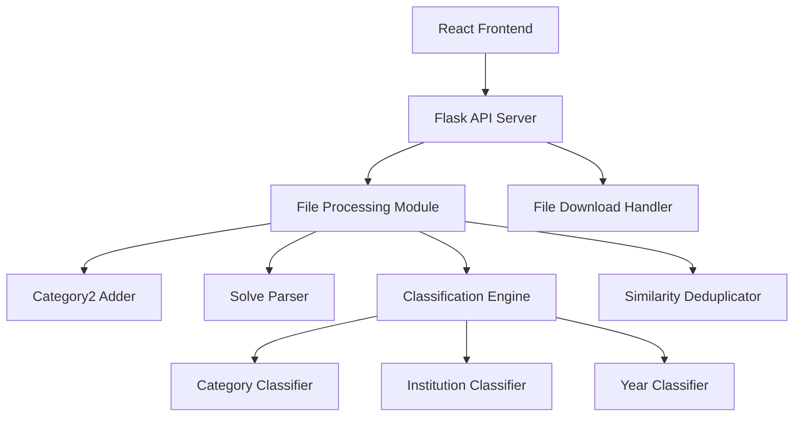

# Design Document

## Overview

The React File Processor is a full-stack application consisting of a Vite React frontend and an enhanced Python Flask backend. The frontend provides a drag-and-drop file upload interface with multiple processing options, while the backend handles JSON file processing with enhanced classification capabilities including institution and year extraction from "solve" fields.

## Architecture



### Frontend Architecture
- **Vite React App**: Modern build tool for fast development
- **Component Structure**: Modular components for upload, processing options, and results
- **State Management**: React hooks for managing application state
- **File Handling**: HTML5 File API for drag-and-drop functionality

### Backend Architecture
- **Flask API Server**: RESTful API endpoints for file processing
- **Enhanced Processing Pipeline**: Extended main.py with solve field parsing
- **Classification Modules**: Separate modules for different classification types
- **File Management**: Temporary file handling and cleanup

## Components and Interfaces

### Frontend Components

#### FileUpload Component
```typescript
interface FileUploadProps {
  onFileUpload: (file: File) => void;
  isUploading: boolean;
}
```
- Handles drag-and-drop file upload
- Validates file type (JSON only)
- Provides visual feedback for drag states

#### ProcessingOptions Component
```typescript
interface ProcessingOptionsProps {
  options: ProcessingOption[];
  onOptionsChange: (selectedOptions: string[]) => void;
  disabled: boolean;
}

interface ProcessingOption {
  id: string;
  label: string;
  description: string;
}
```
- Renders checkbox options for classification types
- Manages selection state
- Enables/disables based on file upload status

#### ResultsDisplay Component
```typescript
interface ResultsDisplayProps {
  results: ProcessingResult[];
  onDownload: (resultId: string) => void;
}

interface ProcessingResult {
  id: string;
  type: string;
  filename: string;
  data: any;
  downloadUrl?: string;
}
```
- Displays processing results
- Provides download buttons for each result
- Shows processing status and error messages

### Backend API Endpoints

#### POST /api/process
```python
Request:
{
  "file_data": "base64_encoded_json",
  "filename": "string",
  "options": ["category", "institution", "year"]
}

Response:
{
  "success": true,
  "results": [
    {
      "type": "category",
      "filename": "category_classification.json",
      "download_id": "uuid"
    }
  ]
}
```

#### GET /api/download/{download_id}
- Returns processed file for download
- Sets appropriate headers for file download
- Cleans up temporary files after download

## Data Models

### Enhanced Question Data Model
```python
class EnhancedQuestion:
    id: int
    title: str
    category1: str
    category2: str
    institution: str  # New field extracted from solve
    year: str        # New field extracted from solve
    solve: str       # Original solve field
    answers: List[Answer]
```

### Solve Parser Model
```python
class SolveInfo:
    institution: str
    year: str
    raw_solve: str
    
    @classmethod
    def parse(cls, solve_string: str) -> 'SolveInfo'
```

### Classification Result Model
```python
class ClassificationResult:
    type: str  # "category", "institution", "year"
    data: Dict[str, Any]
    filename: str
    created_at: datetime
```

## Error Handling

### Frontend Error Handling
- **File Validation Errors**: Display user-friendly messages for invalid file types
- **Network Errors**: Show retry options for failed API calls
- **Processing Errors**: Display backend error messages to users
- **Download Errors**: Handle failed downloads with appropriate feedback

### Backend Error Handling
- **File Processing Errors**: Graceful handling of malformed JSON data
- **Solve Parsing Errors**: Default values for unparseable solve fields
- **Classification Errors**: Fallback to basic classification when advanced options fail
- **Memory Management**: Cleanup of temporary files and data structures

### Error Response Format
```python
{
  "success": false,
  "error": {
    "code": "PROCESSING_ERROR",
    "message": "User-friendly error message",
    "details": "Technical details for debugging"
  }
}
```

## Testing Strategy

### Frontend Testing
- **Unit Tests**: Jest and React Testing Library for component testing
- **Integration Tests**: Testing file upload and API communication
- **E2E Tests**: Cypress tests for complete user workflows
- **Accessibility Tests**: Ensure WCAG compliance

### Backend Testing
- **Unit Tests**: pytest for individual module testing
- **Integration Tests**: Testing API endpoints with sample data
- **Performance Tests**: Testing with large JSON files
- **Error Handling Tests**: Testing various error scenarios

### Test Data
- Primary test file: `python/data/input1.json` with real solve field data
- Sample solve formats: "지방직 7급 / 2022", "서울시 7급 / 2021", "국가직 7급 / 2020"
- Edge cases: missing solve fields, malformed data
- Large datasets for performance testing
- Invalid file formats for error testing

## Performance Considerations

### Frontend Optimizations
- **Code Splitting**: Lazy loading of components
- **File Size Limits**: Client-side validation for large files
- **Progress Indicators**: Visual feedback for long operations
- **Debounced Interactions**: Prevent multiple simultaneous uploads

### Backend Optimizations
- **Streaming Processing**: Handle large files without loading entirely into memory
- **Caching**: Cache processed results for repeated requests
- **Async Processing**: Non-blocking file processing operations
- **Resource Cleanup**: Automatic cleanup of temporary files

## Security Considerations

### File Upload Security
- **File Type Validation**: Server-side validation of file types
- **File Size Limits**: Prevent DoS attacks via large files
- **Content Scanning**: Basic validation of JSON structure
- **Temporary File Management**: Secure handling and cleanup of uploaded files

### API Security
- **Input Validation**: Sanitize all user inputs
- **Rate Limiting**: Prevent abuse of API endpoints
- **Error Information**: Avoid exposing sensitive system information
- **CORS Configuration**: Proper cross-origin resource sharing setup